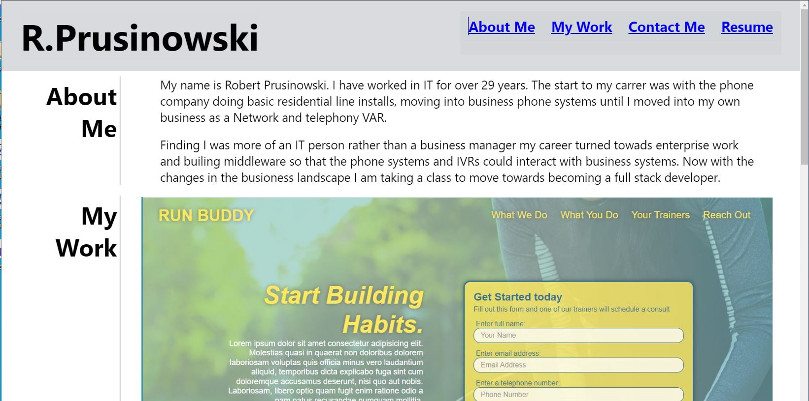

# Roberts Reat Portfolio

<!-- TABLE OF CONTENTS -->

  
Table of Contents

  <ol>
    <li><a href="#description">Description</a></li>
    <li><a href="#user-story">User Story</a></li>
    <li><a href="#built-with">Built With</a></li>
    <li><a href="#maintainer">Contributing</a></li>
    <li><a href="#license">License</a></li>
    <li><a href="#site-link">Site Link</a></li>
    <li><a href="#screenshot">Screenshot</a></li>
  </ol>

## Description

Now that you’ve completed multiple projects, your task is to create a portfolio, using your new React skills to help set you apart from other developers whose portfolios don’t use the latest technologies

## User Story

AS AN employer looking for candidates with experience building single-page applications
I WANT to view a potential employee's deployed React portfolio of work samples
SO THAT I can assess whether they're a good candidate for an open position

## Built-with

JavaScript, Node, NPM, gh-pages, 

## Maintainer

<a href="mailto:bobpruz@gmail.com">Email: Robert Prusinowski</a>

## License

## Site Link

https://bobpruz.github.io/react-portfolio/

## Screenshot

